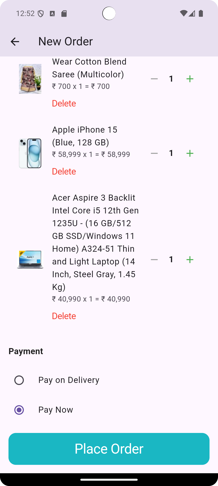

# 🛒 E-Commerce App

This is a fully functional E-commerce application built with Flutter and Dart on the frontend and Node.js, Express, and MongoDB on the backend. The app features a comprehensive shopping experience, from browsing products to payment and order management, with authentication, user profile management, and order history.

---

## 📱 Features

- **Product Catalog**: Browse available products, view product details, and add items to the cart.
- **Cart Management**: Add and remove items, adjust quantities.
- **Checkout and Payment**: Choose a payment method and process payments via Razorpay.
- **User Profile Management**: Login, signup, and profile updates.
- **Order History**: View previous orders in the profile section.
- **Sign Out**: Easily sign out from the profile screen.

## 🛠 Tech Stack

### Frontend

- **Flutter** with **Dart**
- State management with **Provider** and **BLoC**
- **Razorpay** for payment integration

### Backend

- **Node.js**, **Express**
- **MongoDB** database hosted on Render.com

## 📦 Packages Used

The following packages are used in the Flutter app:

- `flutter_bloc: ^8.1.6` - BLoC for state management
- `provider: ^6.1.2` - Provider for dependency injection
- `dio: ^5.7.0` - HTTP client for API calls
- `pretty_dio_logger: ^1.4.0` - Logging for Dio requests
- `cupertino_icons: ^1.0.8` - Cupertino icons for iOS-styled icons
- `email_validator: ^3.0.0` - Email validation for forms
- `shared_preferences: ^2.3.2` - Local storage for user preferences
- `cached_network_image: ^3.4.1` - Image caching
- `intl: ^0.19.0` - Internationalization and formatting
- `flutter_carousel_slider: ^1.1.0` - Product image carousel
- `input_quantity: ^2.4.1` - Quantity selector in cart
- `badges: ^3.1.2` - Badges for notifications, cart icon, etc.
- `razorpay_flutter: ^1.3.7` - Razorpay payment integration
- `equatable: ^2.0.5` - Comparison utility for state management
- `skeletonizer: ^1.4.2` - Skeleton screens for loading effects

---

## 🚀 Getting Started

### Prerequisites

Ensure you have Flutter and Dart installed. You can check this by running:

```bash
flutter --version
```

### Installation

1. **Clone the repository**:

   ```bash
   git clone https://github.com/piro-piyush/E-commerce-App.git
   cd E-commerce-App
   ```

2. **Install dependencies**:

   ```bash
   flutter pub get
   ```

3. **Configure Backend**:
   Ensure that your backend server is set up on Render.com and replace the API endpoint in the Flutter project as required.

4. **Run the App**:
   ```bash
   flutter run
   ```

---

## 🎬 Demo

Screenshots for each screen are available in the `assets` folder, and a screen recording is also provided as `demo.gif` in the root directory.

### Screenshots

<table>
  <tr align="center">
    <td align="center">
      <p>Login Screen</p>
      
    </td>
    <td align="center">
      <p>SignUp Screen</p>
      
    </td>
    <td align="center">
      <p>Home Screen</p>
      
    </td>
    <td align="center">
      <p>Categories</p>
      
    </td>
  </tr>
  <tr align="center">
    <td align="center">
      <p>Product Details Screen</p>
      
    </td>
    <td align="center">
      <p>Cart Screen</p>
      
    </td>
     <td align="center">
      <p>Profile Screen</p>
      
    </td>
    <td align="center">
      <p>Checkout Screen</p>
      
    </td>
  </tr>
  <tr align="center">
    <td align="center">
      <p>Razorpay Screen</p>
      
    </td>
    <td align="center">
      <p>Razorpay Success Screen</p>
      
    </td>
     <td align="center">
      <p>Order Placed Screen</p>
      
    </td>
    <td align="center">
      <p>Products By Category Screen</p>
      
    </td>
  </tr>
</table>

---

### Demo Video

A screen recording is available as `demo.gif` in the root directory to showcase the app flow.

**Screen Recording**

<p align="center">
  
   </p>

---

## 🔐 Authentication

- **Sign Up / Login**: Users can create an account or log in to their existing account.
- **Session Management**: User sessions are managed locally using shared preferences.

---

## 📂 Folder Structure

- `E-commerce-App/Frontend/lib/core/api.dart`: Contains API endpoint configurations.
- `E-commerce-App/Frontend/lib/core/routes.dart`: Contains API endpoint configurations.
- `E-commerce-App/Frontend/lib/core/ui.dart`: Contains API endpoint configurations.
- `E-commerce-App/Frontend/lib/data/models`: Includes the data models.
- `E-commerce-App/Frontend/lib/data/repositories`: Contains repositories for data access and handling.
- `E-commerce-App/Frontend/lib/logic/cubit/`: State management cubits for handling business logic.
- `E-commerce-App/Frontend/lib/logic/services/`: Contains service classes for API calls and other logic.
- `E-commerce-App/Frontend/lib/presentation/screen`: Contains service classes for API calls and other logic.
- `E-commerce-App/Frontend/lib/presentation/widgets`: Custom reusable widgets for UI components.
- `E-commerce-App/Frontend/lib/main.dart`: Custom reusable widgets for UI components.
- `E-commerce-App/assets`: Custom reusable widgets for UI components.

---

## 📝 License

This project is licensed under the MIT License.

---

## 📧 Contact

For any issues or inquiries, feel free to reach out.

---

Happy Shopping! 🛍️
